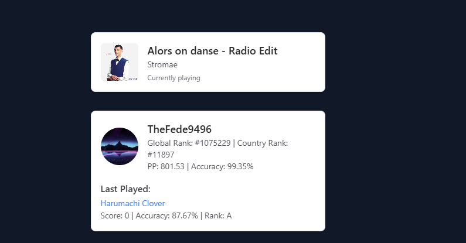

# Spotify and osu! Widgets for Astro



This project provides customizable Spotify and osu! widgets for your Astro-based website. These widgets display your current Spotify listening status and osu! player statistics.

## Table of Contents

1. [Prerequisites](#prerequisites)
2. [Installation](#installation)
3. [Configuration](#configuration)
4. [Usage](#usage)
5. [File Structure](#file-structure)
6. [Customization](#customization)
7. [Troubleshooting](#troubleshooting)

## Prerequisites

- Node.js (v14 or later)
- npm or yarn
- An Astro project set up
- Spotify Developer account and application
- osu! account and API credentials

## Installation

1. Install the required dependencies:

   ```bash
   npm install @astrojs/svelte svelte @vercel/kv zod
   ```

2. Add the Svelte integration to your Astro config file (`astro.config.mjs`):

   ```javascript
   import { defineConfig } from 'astro/config';
   import svelte from '@astrojs/svelte';

   export default defineConfig({
     integrations: [svelte()],
   });
   ```

## Configuration

1. Create a `.env` file in your project root and add the following variables:

   ```bash
   SPOTIFY_CLIENT_ID=your_spotify_client_id
   SPOTIFY_CLIENT_SECRET=your_spotify_client_secret
   SPOTIFY_REFRESH_TOKEN=your_spotify_refresh_token
   OSU_CLIENT_ID=your_osu_client_id
   OSU_CLIENT_SECRET=your_osu_client_secret
   OSU_USER_ID=your_osu_user_id
   KV_REST_API_URL=your_vercel_kv_url
   KV_REST_API_TOKEN=your_vercel_kv_token
   ```

2. Set up Vercel KV for caching (optional but recommended):

   - Create a Vercel account and set up KV storage
   - Add the `KV_REST_API_URL` and `KV_REST_API_TOKEN` to your environment variables

3. For a guide on how to get a spotify refresh token go (here)[https://github.com/vimfn/get-spotify-refresh-token]

4. osu! API

- Go to the osu! OAuth Application page.
- Create a new application and fill in the required information.
- Once created, you will get your Client ID and Client Secret.
- Retrieve your User ID from your osu! profile URL (e.g., if your profile is https://osu.ppy.sh/users/123456, your User ID is 123456).

## Usage

1. Add the Spotify widget to your Astro page:

   ```astro
   ---
   import Spotify from '../components/Spotify.svelte';
   ---

   <Spotify client:load />
   ```

2. Add the osu! widget to your Astro page:

   ```astro
   ---
   import Osu from '../components/Osu.svelte';
   ---

   <Osu client:load />
   ```

## File Structure

Place the following files in your Astro project:

```plaintext
src/
├── components/
│   ├── Spotify.svelte
│   └── Osu.svelte
└── pages/
    └── api/
        ├── spotify.json.ts
        └── osu.json.ts
```

## Customization

You can customize the appearance of the widgets by modifying the Svelte components (`Spotify.svelte` and `Osu.svelte`). The widgets use Tailwind CSS classes for styling, which you can adjust to match your site's design.

## Troubleshooting

- If you encounter CORS issues, ensure your Astro project is properly configured to handle API routes.
- Check that all environment variables are correctly set.
- For Spotify issues, ensure your refresh token is valid and has the necessary scopes.
- For osu! issues, verify that your API credentials are correct and that you're not exceeding rate limits.

## Contributing

Contributions are welcome! Please feel free to submit a Pull Request.

## License

This project is open source and available under the MIT License.
```
